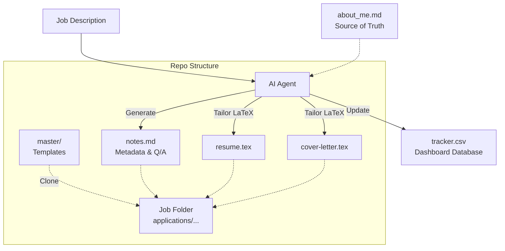

# Agentic Resume Framework

  

## The Story Behind the Framework

After extensive research, testing numerous automation pipelines, and building multiple custom tools from scratch, I developed this framework to solve the ultimate job seeker's bottleneck: **tailoring applications efficiently without sacrificing quality.**

This repository represents the **most efficient, fast, and reliable approach** to generating highly tailored, editable LaTeX resumes and cover letters. By providing strict boundaries and a single source of truth, an AI coding agent can autonomously manage your job application pipeline—maintaining formatting, tracking progress, and delivering precise customizations for every role.

---

## 🏗️ Architecture & Workflow

The framework operates on a strict directory structure, routing new jobs into proper categories, safely cloning master templates, and then injecting highly tailored LaTeX content driven by your actual background (`about_me.md`).

---

## ⚙️ Setup Instructions

To use this framework with your own AI coding agent (like Claude, Gemini, or ChatGPT within an IDE/Terminal setup), follow these steps:

### 1. Clone or Download this Template
Start by creating your own private repository using this structure. 
**Warning:** Ensure you keep this repository private if you include personal contact information (phone numbers, private email addresses) in the master templates.

### 2. Configure Your Master Templates
Navigate to the `master/` directory and fill out the LaTeX templates:
- `master-resume.tex`: Build your comprehensive resume. Replace any placeholder contact info with your own.
- `master-cover-letter.tex`: Update the header blocks and signature with your name and contact details.

### 3. Create Your `about_me.md`
This is the **Source of Truth** for the AI Agent. Document your entire professional background here:
- Complete job histories
- Project details, metrics, and outcomes
- Technical skills and certifications
- Education and language proficiency
*The more detailed this file is, the better the AI can tailor your applications to specific job descriptions without hallucinating.*

### 4. Provide the System Instructions
The file `.instructions.md` acts as the strict system prompt for the AI agent. It defines the folder structure, editing constraints, and the mandatory step-by-step workflow.

---

## 🚀 How to Use (The Workflow)

When you are ready to apply for a job:

1. **Invoke your AI Agent** in the root of the repository.
2. **Provide the Job Description:**
   > *"I want to apply for the Senior AI Engineer role at Google. Here is the job description: [Paste JD here]. Please follow the repository instructions."*
3. **The Agent takes over and will autonomously:**
   - Categorize the job and create a dedicated folder.
   - Clone your master templates safely.
   - Use `about_me.md` to perfectly tailor your LaTeX resume and cover letter for the role.
   - Generate a `notes.md` with application metadata.
   - Update the `tracker.csv` database so you can monitor your application status.
4. **Compile & Submit:** Review the tailored LaTeX files, compile them to PDFs locally or via Overleaf, and submit your application!

---

*Built with precision for the modern, AI-augmented job seeker.*
