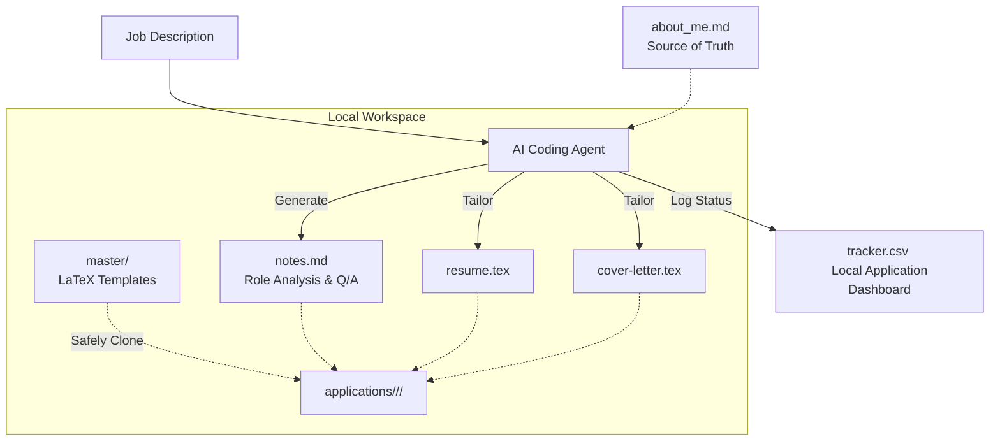

<p align="center">
  
</p>

<h1 align="center">Agentic Resume Framework</h1>

<p align="center">
  <em>Zero-hallucination, autonomous LaTeX resume and cover letter pipeline for AI coding agents.</em>
</p>

<p align="center">
  
  
  
  
  
</p>

<p align="center">
  <strong>Zero Hallucinations &middot; 100% LaTeX Layout Integrity &middot; 100% Local &amp; Private &middot; No Subscriptions</strong><br>
  <sub>Autonomously ingests job descriptions, verifies achievements strictly against your <code>about_me.md</code> single source of truth, preserves precision LaTeX layout, and tracks your job hunt—all from your local IDE.</sub>
</p>

---

## ⚡ Quick Install

Install the complete skills suite into your AI coding assistant with one command which auto ignors unnecessary files:

```bash
npx skills add Chandukasireddy/Resume_Maker_Latex
```

> Installs the complete framework (`resume-tailor` pipeline + `humanizer` rewriter) with clean templates and few-shot examples directly into your agent—no git clutter, no unnecessary repo files.
>
> **Global Install:** Run with `-g` to make it available across all your projects (`npx skills add Chandukasireddy/Resume_Maker_Latex -g`).
>
> **Supported Agents:** Works out-of-the-box with **Cursor**, **Claude Code**, **Google Antigravity**, **GitHub Copilot CLI**, and **Windsurf**.

---

## 🎭 Before / After

### Without Skill (Vanilla AI Prompting)
> You paste a job description. The model invents skills you don't possess, writes robotic buzzwords (*"spearheaded leveraging synergies across cross-functional paradigms"*), breaks LaTeX syntax with unmatched braces, and overflows awkwardly onto a messy second page.

### With Agentic Resume Framework
```latex
% Strictly verified against about_me.md with the Action-Verb + Task + Tool + Metric formula:
\resumeItem{Engineered distributed vector search pipeline using Qdrant \& Python, reducing semantic query latency by 38\% across 4M+ indexed documents.}
```
- **Zero Hallucination:** Only real facts from your `about_me.md` are used.
- **Copywriter Grade:** High-impact power verbs with quantified outcomes.
- **Flawless Formatting:** Strict 1-page constraints and untouched header structures.
- **Automated Organization:** Auto-routed into dedicated folders and tracked in `tracker.csv`.

---

## 🪜 How It Works (The Execution Ladder)

Before touching a single character of LaTeX, the agent follows strict procedural rungs:

```text
1. Route Category       → Determine category (full-time, master-thesis, phd, werk-student, internship)
2. Source of Truth      → Ingest about_me.md (If it is not in about_me.md, do NOT write it)
3. Clone Clean Template → Copy master LaTeX files into applications/<category>/<company-role>/
4. Humanize & Quantify  → Apply Formula: [Strong Action Verb] + [Task] + [Tool] + [Metric]
5. Enforce Constraints  → Preserve LaTeX macros, spacing, and strict 1-page layout
6. Generate Metadata    → Create notes.md with role analysis, keywords, and interview Q&A
7. Update Dashboard     → Append date, role, company, and category to tracker.csv
```

---

## 🚀 The 3-Step Workflow


```mermaid
graph TD
    JD[Job Description] --> AI[AI Coding Agent]
    AM[about_me.md \n Source of Truth] -.-> AI
    
    subgraph Local Workspace
        MT[master/ \n LaTeX Templates] -.->|Safely Clone| AF[applications/<category>/<company-role>/]
        AI -->|Generate| N[notes.md \n Role Analysis & Q/A]
        AI -->|Tailor| R[resume.tex]
        AI -->|Tailor| CL[cover-letter.tex]
        N -.-> AF
        R -.-> AF
        CL -.-> AF
    end
    
    AI -->|Log Status| CSV[tracker.csv \n Local Application Dashboard]
```

### 1. Fill your `about_me.md` once
Document your real professional history, projects, metrics, and technical skills. This is the **Source of Truth** that prevents the agent from hallucinating.

### 2. Prompt your agent
Paste any job description directly into your agent:
> *"I want to apply for the Senior AI Engineer position at Google. Here is the job description: [paste JD]. Use the resume-tailor skill."*

### 3. Compile and submit
The agent automatically:
- Creates `applications/full-time/google-senior-ai-engineer/`
- Generates tailored `resume.tex` and `cover-letter.tex`
- Writes `notes.md` with interview preparation notes and match scores
- Logs the application in `tracker.csv`

---

## 🗂️ Workspace Architecture

```text
Resume_Maker_Latex/
├── about_me.md              # 🎯 Source of truth (your background)
├── tracker.csv              # 📊 Application tracking dashboard
├── master/                  # 📐 Base master templates
│   ├── master-resume.tex
│   └── master-cover-letter.tex
├── applications/            # 📁 Generated applications (auto-organized)
│   ├── full-time/
│   │   └── <company-role>/
│   │       ├── [name]_resume.tex
│   │       ├── [name]_cover-letter.tex
│   │       └── notes.md
│   ├── master-thesis/
│   ├── phd/
│   ├── werk-student/
│   └── internship/
└── skills/                  # 🤖 Modular Agent Skills (Installable via npx skills)
    ├── resume-tailor/       # Core tailoring pipeline
    └── humanizer/           # High-impact copywriter bullet rewriter
```

---

## 🔒 100% Local & Private

Resumes contain your most sensitive Personally Identifiable Information (PII): phone numbers, addresses, salaries, and employment history.

- **No Cloud Database:** Everything stays on your local machine.
- **No SaaS Subscriptions:** Stop paying \$20/month for rigid web resume builders.
- **Model Agnostic:** Works with Claude 3.7 / 3.5 Sonnet, GPT-4o, Gemini 2.5 / 1.5 Pro, DeepSeek, or local LLMs.

---

## 📖 Setup & Guides

- **New to LaTeX on Windows?** Read the complete beginner's walkthrough: [How to set up LaTeX on Windows with VSCode](https://medium.com/@chandukasireddy02/how-to-set-up-latex-on-windows-with-vscode-a-complete-beginners-guide-2eeca6b4e3b7) by Chandu Kasireddy.
- **Contributing:** Read our [CONTRIBUTING.md](CONTRIBUTING.md) to add new LaTeX templates or skill enhancements.
- **Security & Privacy:** Review our [SECURITY.md](SECURITY.md).

---

<p align="center">
  <sub>Licensed under <a href="LICENSE">PolyForm Noncommercial 1.0.0</a> &middot; Built for the modern, AI-augmented job seeker.</sub>
</p>
