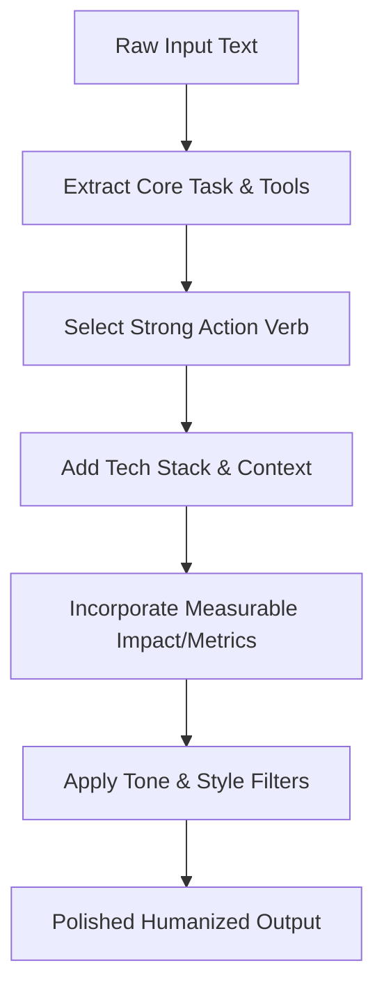

# Humanizer Skill

The **Humanizer Skill** transforms raw, low-impact, or robotic resume text into polished, high-impact resume content. It ensures bullet points sound like they were written by a professional technical copywriter rather than generated by a basic AI model.

---

## When to Trigger This Skill

Trigger this skill whenever the user asks to:
- "Humanize my resume bullets"
- "Rewrite my project points to sound better"
- "Make my resume sound more professional / high impact"
- "Quantify my bullet points"
- "Improve my profile summary / about section"
- Tailor raw bullet points for a job description.

---

## Core Workflow

1. **Analyze Input:** Identify the core action, tools/technologies used, and the intended outcome.
2. **Apply Rewriting Formula:** Refer to [bullet-rewriting-formula.md](file:///c:/Users/prave/Desktop/projects/latex_applications/skills/humanizer/references/bullet-rewriting-formula.md).
3. **Select High-Impact Verbs:** Pick domain-appropriate power verbs from [action-verbs-list.md](file:///c:/Users/prave/Desktop/projects/latex_applications/skills/humanizer/references/action-verbs-list.md). Avoid banned weak phrases (*"Responsible for"*, *"Worked on"*, *"Helped with"*).
4. **Refine Tone & Style:** Enforce rules from [tone-and-voice-guide.md](file:///c:/Users/prave/Desktop/projects/latex_applications/skills/humanizer/references/tone-and-voice-guide.md) (eliminate AI buzzwords like *leveraged*, *utilizing*, *spearheaded*).
5. **Cross-Check Examples:** Compare output against domain benchmarks in [before-after-bullets.md](file:///c:/Users/prave/Desktop/projects/latex_applications/skills/humanizer/examples/before-after-bullets.md) and [before-after-profiles.md](file:///c:/Users/prave/Desktop/projects/latex_applications/skills/humanizer/examples/before-after-profiles.md).

---

## Key Formula Summary

Every resume bullet point must follow this standard structure:

$$\text{[Strong Action Verb]} + \text{[Core Task / System Built]} + \text{[Tools / Technologies Used]} + \text{[Measurable Impact / Metric]}$$

### Quick Example:
- ❌ **Raw:** *"Fixed bugs in Python database script"*
- ✅ **Humanized:** *"Resolved critical database bottlenecks in Python, improving query execution speed by 35% and reducing server load"*

---

## Skill File Map

- 📘 [Bullet Rewriting Formula](file:///c:/Users/prave/Desktop/projects/latex_applications/skills/humanizer/references/bullet-rewriting-formula.md) - The mandatory structural framework for every bullet point.
- 🗣️ [Tone & Voice Guide](file:///c:/Users/prave/Desktop/projects/latex_applications/skills/humanizer/references/tone-and-voice-guide.md) - Guidelines for natural, non-robotic phrasing and metric estimates.
- ⚡ [Action Verbs List](file:///c:/Users/prave/Desktop/projects/latex_applications/skills/humanizer/references/action-verbs-list.md) - 100+ domain-specific power verbs.
- 💡 [Before & After Bullets](file:///c:/Users/prave/Desktop/projects/latex_applications/skills/humanizer/examples/before-after-bullets.md) - 20+ domain-specific bullet transformations.
- 👤 [Before & After Profiles](file:///c:/Users/prave/Desktop/projects/latex_applications/skills/humanizer/examples/before-after-profiles.md) - Profile summary rewrite examples.
