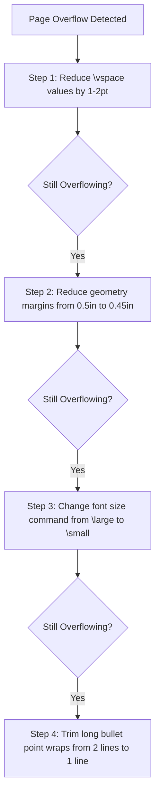

# Layout & Spacing Guide

A technical guide to managing vertical spacing and margins in LaTeX to ensure resume content fits strictly on **1 single page**.

---

## 1. Golden Rules of 1-Page Resume Layout

1. **Page Limit:** A student, intern, or early-career resume MUST fit on exactly **1 page**. Spilling 2–3 lines onto a second page looks unprofessional.
2. **Symmetrical Margins:** Maintain consistent margins (0.5 in to 0.75 in) on all four sides.
3. **Micro-Adjust Spacing First:** Before cutting bullet points or text, adjust LaTeX vertical spacing parameters (`\vspace`).

---

## 2. Global Document Setup Parameters

### Geometry Package Settings
Use `geometry` to define page boundaries:

```latex
\usepackage[empty]{fullpage}
\usepackage[left=0.5in, top=0.5in, right=0.5in, bottom=0.5in]{geometry}
```

- **Standard Margin:** `0.5in` (gives maximum room while staying readable).
- **Tight Margin:** `0.4in` (use only if content slightly overflows).

---

## 3. Micro-Spacing Adjustment Commands (`\vspace`)

Use negative `\vspace` commands to shrink whitespace between sections and items:

| Location | Recommended Command | Purpose |
|---|---|---|
| Under Section Title | `\vspace{-5pt}` | Reduces space between section line and first entry |
| Between Experience Entries | `\vspace{-4pt}` | Reduces gap between job listings |
| Under Itemize List | `\vspace{-5pt}` | Shrinks gap after bullet lists |
| After Contact Header | `\vspace{-8pt}` | Reduces space below contact information header |

### Example Application:
```latex
\section{Technical Skills}
\vspace{-4pt}
\begin{itemize}[leftmargin=0.15in, label={}]
    \small{\item{
     \textbf{Languages}: Python, C++, Java, TypeScript, SQL \\
     \textbf{Frameworks}: PyTorch, FastAPI, React, Docker, AWS
    }}
\end{itemize}
\vspace{-10pt}
```

---

## 4. `enumitem` Micro-Tuning Parameters

Control list item spacing precisely using `enumitem`:

```latex
\usepackage{enumitem}

\setlist[itemize]{
  noitemsep,       % Eliminates space between items
  topsep=0pt,      % Eliminates space above list
  parsep=0pt,      % Eliminates paragraph space inside items
  partopsep=0pt    % Eliminates extra space if list starts paragraph
}
```

---

## 5. Emergency Overflow Diagnostic Checklist

If the compiled PDF overflows onto Page 2 by a few lines, follow this 4-step sequence:



1. **Reduce Section Vspace:** Lower section `\vspace{-5pt}` to `\vspace{-7pt}`.
2. **Reduce Margins:** Change `top=0.5in, bottom=0.5in` to `top=0.4in, bottom=0.4in`.
3. **Trim Wrap Lines:** Look for bullet points where 1 or 2 words spill onto a second line. Rewording 2 words can save an entire line of vertical height!
