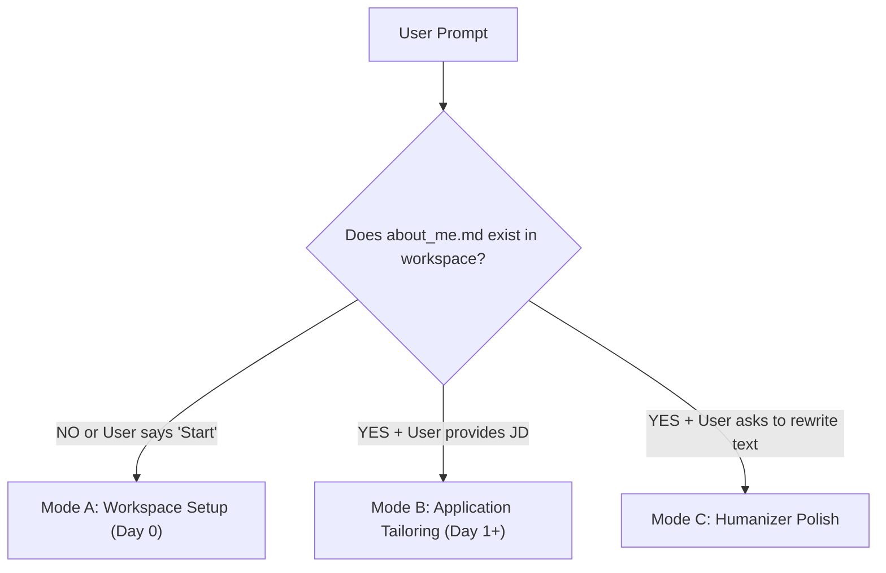

# Resume Tailor Skill

The **Resume Tailor Skill** is an autonomous pipeline that manages job applications in LaTeX with strict layout integrity, zero hallucinations, and automatic application tracking.

---

## ⚡ Mode Detection Ladder

When invoked, immediately check the state of the current workspace:

### Mode A: Workspace Setup (Day 0)
*Trigger:* User says *"Start"*, *"Set up my resume workspace"*, or pastes their raw resume in a directory where `about_me.md` does not yet exist.
- **Runbook:** Read and execute [workspace-init.md](./references/workspace-init.md).
- **Actions:**
  1. Parse the user's provided resume into `about_me.md` using [about_me_schema.md](./resources/schema/about_me_schema.md).
  2. Create `applications/` category folders (full-time, master-thesis, phd, werk-student, internship).
  3. Create `master/` and copy clean LaTeX templates from [resources/templates/](./resources/templates/).
  4. Initialize `tracker.csv` with standard column headers.
  5. Confirm setup is complete and invite the user to paste their first Job Description.

---

### Mode B: Job Application Tailoring (Day 1+)
*Trigger:* `about_me.md` already exists and user provides a Job Description (e.g., *"Apply for Senior AI Engineer at BMW: [JD]"*).
- **Runbook:** Read and execute [tailor-workflow.md](./references/tailor-workflow.md).
- **Actions:**
  1. Route to category folder via [category-routing.md](./references/category-routing.md) (`applications/<category>/<company-role>/`).
  2. Clone only `master/master-resume.tex` and `master/master-cover-letter.tex` into the job folder.
  3. Create `notes.md` with metadata, Q&A, and full JD following [sample-notes.md](./examples/sample-notes.md).
  4. Tailor resume LaTeX strictly against `about_me.md` and [latex-rules.md](./references/latex-rules.md) using the [humanizer-formula.md](./references/humanizer-formula.md).
  5. Rewrite cover letter in exactly two paragraphs under one page.
  6. Append application record to `tracker.csv`.

---

### Mode C: Humanizer Polish (Ad-hoc)
*Trigger:* User asks to polish, rewrite, or quantify resume bullets without generating a full job application.
- **Runbook:** Read and apply [humanizer-formula.md](./references/humanizer-formula.md).
- Output polished bullets following:
  $$\text{[Strong Action Verb]} + \text{[Core Task]} + \text{[Tool / Stack]} + \text{[Quantified Metric]}$$

## 🔒 Strict Mock Data Boundary Rule

All files under `examples/` are **read-only structural benchmarks**:
- **NEVER** copy mock names (e.g. "Jane Doe") or sample companies into real application files.
- **NEVER** append rows from `sample-tracker.csv` into the user's real `tracker.csv`.
- Populate `about_me.md`, `tracker.csv`, and job folders **exclusively** with data from the user's genuine resume and input.

---

## 📚 Skill Resource & Reference Map

- 🚀 [Workspace Initialization Runbook](./references/workspace-init.md) — Day 0 setup instructions.
- 🎯 [Application Tailoring Runbook](./references/tailor-workflow.md) — Day 1+ 7-step tailoring engine.
- 📂 [Category Routing Rules](./references/category-routing.md) — Category folder selection rules.
- 📐 [LaTeX Rules & Length Limits](./references/latex-rules.md) — Layout preservation and character caps.
- ✨ [Humanizer Rewriting Formula](./references/humanizer-formula.md) — Action-verb formula and banned AI words.
- 📋 [About Me Schema](./resources/schema/about_me_schema.md) — Blueprint for parsing resumes.
-  [Sample about_me.md Example](./examples/sample-about_me.md) — Few-shot benchmark of a filled profile.
- 📊 [Sample tracker.csv Example](./examples/sample-tracker.csv) — Few-shot benchmark of tracked applications.
- 📁 [Sample Job Application](./examples/sample-application/google-senior-ai-engineer/) — Full mock application folder containing:
  - [Sample Resume](./examples/sample-application/google-senior-ai-engineer/jane_doe_resume.tex)
  - [Sample Cover Letter](./examples/sample-application/google-senior-ai-engineer/jane_doe_cover-letter.tex)
  - [Sample notes.md](./examples/sample-application/google-senior-ai-engineer/notes.md)
